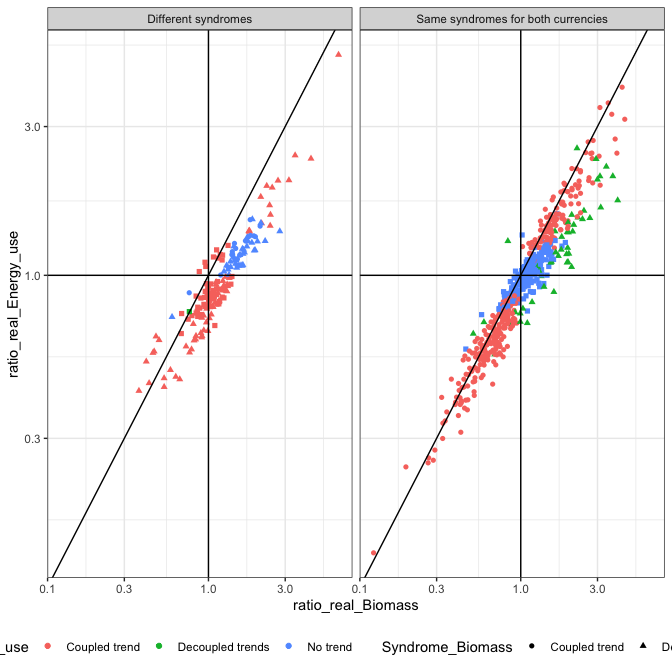

## Example of biomass and energy showing different behaviors

For about 1/4 of routes, biomass and total energy use have different
“syndromes” (coupled trend, decoupled trend, no trend):

| Same\_syndrome                     |   n | total | prop |
| :--------------------------------- | --: | ----: | ---: |
| Different syndromes                | 176 |   739 | 0.24 |
| Same syndromes for both currencies | 563 |   739 | 0.76 |

<!-- -->

#### Sample route with different syndromes

| matssname        | ratio\_sim\_Biomass | ratio\_sim\_Energy\_use | ratio\_real\_Biomass | ratio\_real\_Energy\_use | modelcomplexity\_Biomass | modelcomplexity\_Energy\_use | winning\_formula\_Biomass | winning\_formula\_Energy\_use | Syndrome\_Biomass | Syndrome\_Energy\_use | Same\_syndrome      |
| :--------------- | ------------------: | ----------------------: | -------------------: | -----------------------: | -----------------------: | ---------------------------: | :------------------------ | :---------------------------- | :---------------- | :-------------------- | :------------------ |
| bbs\_rtrg\_6\_39 |           0.7044827 |               0.6959935 |             1.227789 |                0.8941509 |                        4 |                            2 | timeperiod \* source      | timeperiod                    | Decoupled trends  | Coupled trend         | Different syndromes |

<!-- -->
