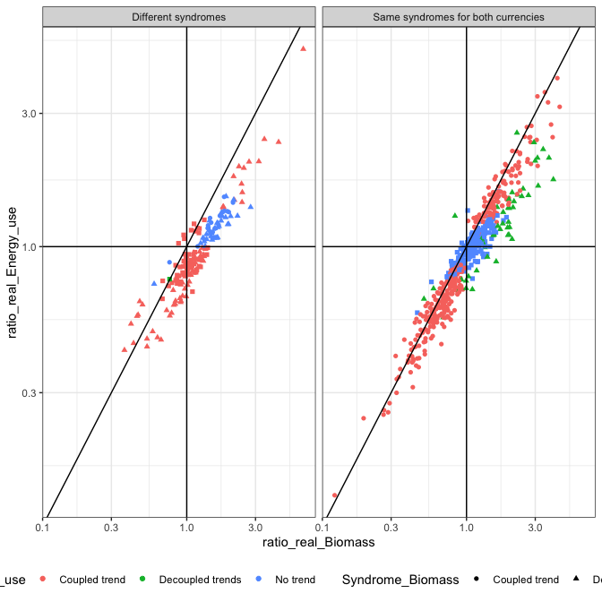
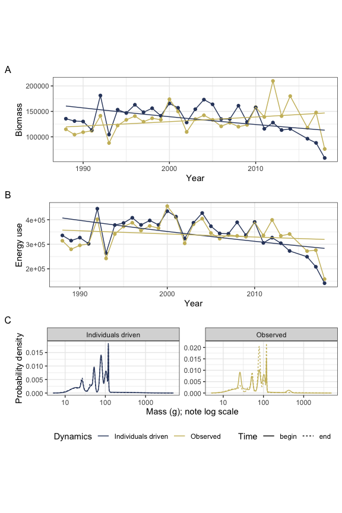

| currency | model\_formula       |   n |
| :------- | :------------------- | --: |
| biomass  | 1                    | 239 |
| biomass  | timeperiod           | 351 |
| biomass  | timeperiod \* source | 149 |
| energy   | 1                    | 230 |
| energy   | timeperiod           | 456 |
| energy   | timeperiod \* source |  53 |

## New figs here\!\!\!

# Figure 3. Visualizing decoupling

<!-- -->

| Same\_syndrome                     |   n | total | prop |
| :--------------------------------- | --: | ----: | ---: |
| Different syndromes                | 176 |   739 | 0.24 |
| Same syndromes for both currencies | 563 |   739 | 0.76 |

Observations…

  - For about 1/4 of routes, the outcome for energy use is different
    from the one for biomass.
  - Usually the slope for energy use is less positive than for biomass.
    This makes sense to me given the \<1 scaling exponent.

#### Sample route with different syndromes

| matssname        | ratio\_sim\_Biomass | ratio\_sim\_Energy\_use | ratio\_real\_Biomass | ratio\_real\_Energy\_use | modelcomplexity\_Biomass | modelcomplexity\_Energy\_use | winning\_formula\_Biomass | winning\_formula\_Energy\_use | Syndrome\_Biomass | Syndrome\_Energy\_use | Same\_syndrome      |
| :--------------- | ------------------: | ----------------------: | -------------------: | -----------------------: | -----------------------: | ---------------------------: | :------------------------ | :---------------------------- | :---------------- | :-------------------- | :------------------ |
| bbs\_rtrg\_6\_39 |           0.7044827 |               0.6959935 |             1.227789 |                0.8941509 |                        4 |                            2 | timeperiod \* source      | timeperiod                    | Decoupled trends  | Coupled trend         | Different syndromes |

<!-- -->

# Results using 0 standard deviation

| currency | model\_formula       |   n | total |
| :------- | :------------------- | --: | ----: |
| biomass  | 1                    | 239 |   739 |
| biomass  | timeperiod           | 352 |   739 |
| biomass  | timeperiod \* source | 148 |   739 |
| energy   | 1                    | 230 |   739 |
| energy   | timeperiod           | 454 |   739 |
| energy   | timeperiod \* source |  55 |   739 |

    ## [1] 0.9939107

<!-- --><!-- -->

# Results running the null model deterministically

Instead of sampling N individuals from a multinomial with weighted
probabilities, multiply the vector of probability weights by N. Because
we need to have whole numbers of birds, we round to integers. This can
result in a number of individuals that is not equal to N; as far as I’ve
seen it tends to result in *fewer* individuals than N.

| currency | model\_formula       |   n | total |
| :------- | :------------------- | --: | ----: |
| biomass  | 1                    | 207 |   739 |
| biomass  | timeperiod           | 363 |   739 |
| biomass  | timeperiod \* source | 162 |   739 |
| biomass  | timeperiod + source  |   7 |   739 |
| energy   | 1                    | 223 |   739 |
| energy   | timeperiod           | 461 |   739 |
| energy   | timeperiod \* source |  54 |   739 |
| energy   | timeperiod + source  |   1 |   739 |

    ## [1] 0.9221922

<!-- --><!-- --><!-- -->
